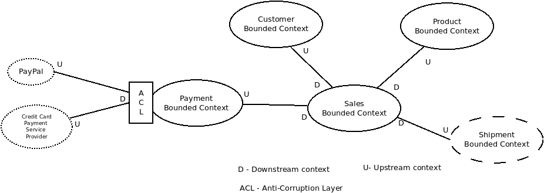
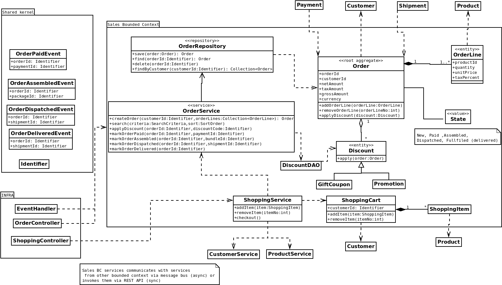

# ddd-basics-assignment


## Design

### Bounded Contexts
Five bounded contexts could be identified:


1. Customer Bounded Context

Context handles customer subdomain, all data and flows related to customer aggregate (adding/removing/updating customer
with address data and billing data)

2. Product Bounded Context

Context focuses on product aggregate its availability, price and (optionally - not included in task description)
vendors/suppliers

Supports also product search & filter operation to let end user find the product they would like to buy.

3. Payment Bounded Context

Context delegates payment process to 3rd party payment service providers - (e.g PayPal or credit card PSP (e.g.
Worldpay). It could either use Anti-Corruption Layer or Open Host Service (e.g PayPal API) to prevent mixing "our"
ubiquitous language with external contexts terms.

4. Shipment Bounded Context

Context handles shipment process, similar to Payment BC it could either implement that process or delegate it to
external shipment service providers

5. Sales Bounded Context

Context is responsible for:

- shopping cart handling

- order creation, updates, fulfillment and order history


### Sales Bounded Context - details



End user adds/removes items to shopping cart (UI interacts with shopping cart via Shopping controller)

When customer finalizes shopping ShoppingService double checks availability of selected product via ProductService, if
products are available then ShoppingService instructs OrderService to create the order.

Next end user can apply gift coupons/promotion codes - UI interacts with the order via OrderController which fetches
discount via DiscountDAO

After that end user starts payment (it's covered by Payment Bounded Context) what results in OrderPaidEvent that is
handled by EventHandler which invokes markOrderPaid at OrderService.

Another transitions (order assembled, dispatched, fulfilled) that happen in other bounded context are also communicated
via events which contain identifier of the order and another root aggregate from other bounded context (e.g. shipment)

Services across contexts communicate with each other asynchronously (events mechanism described just above) or
synchronously via REST calls or if they are all in one physical process (e.g. JVM) they could also use IoC container (
e.g. Spring or J2EE container) to inject one service into another  

## Implementation

There are following packages:
* sales (sales bounded context implementation)
* shared (shared kernel)

`sales` package conists of `domain` and `infra` subpackages and `Demo` class

`Demo` class shows example flow when client adds items to the shopping cart and checks out.
As a result, the order is created.
Next order is changed in response to published domain events (e.g. order paid, order assembled etc)

`domain` package contains entities and domain services and repositories interfaces.
`infra` contains in-memory implementation for repositories and `MessageBus`


### Running a demo
Prerequisites:
* Java 16
* Maven 3.X

```
maven clean install
java -jar target/ddd-assignment-1.0-SNAPSHOT-jar-with-dependencies.jar                                  
```